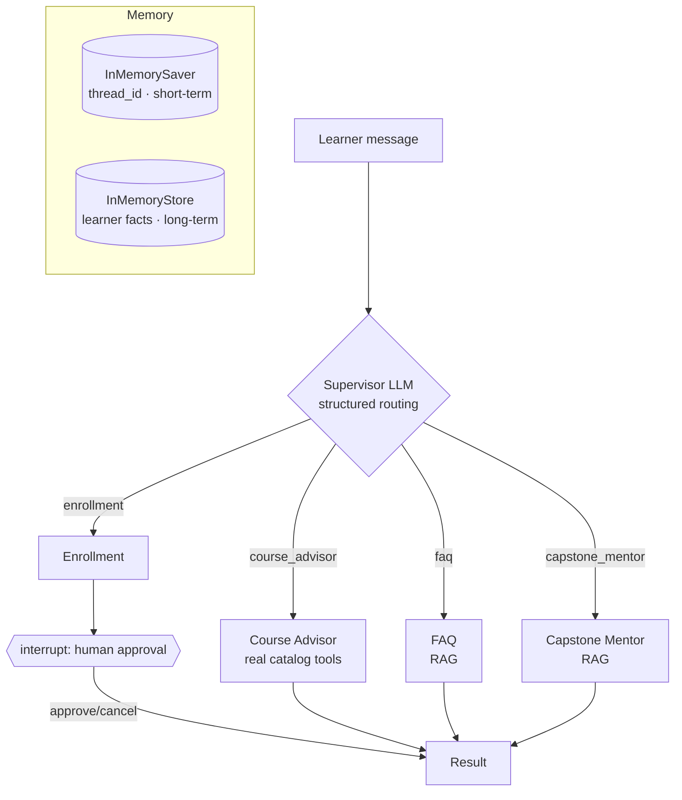

# DAICO Navigator - an Agentic AI Assistant for the DAICO Center

A multi-agent assistant that helps learners at the **DAICO** center (Data & AI Center of Excellence,
King Saud University) discover courses, check prerequisites and seats, answer policy/FAQ questions, get
capstone guidance, and enroll - with a human approving every enrollment. Built on the **LangGraph
Functional API**.

> **Capstone project** for **Building Agentic AI Systems (AGT-401)**.
> **Programme:** SDAIA Academy - *Building Agentic AI Systems*, hosted at DAICO, King Saud University (KSU), sponsored by **SDAIA**.
> **Cohort:** 16-20 August 2026 (5 days).
> **Declared track:** **Track A - Supervisor** (with a **Track B** human handoff for enrollment).

### Team
- **Hamed Ahmed Aldkhyyal**
- **Saif Fawaz Alanzi**
- **Fahad Abdullah Alanazi**
- **Yousef Farhan Alanzi**

---

## What it does

A **supervisor LLM** reads each learner message and routes it - using constrained structured output, not
keyword rules - to one of four specialist workers:

| Worker | Handles | Backed by |
|---|---|---|
| **Course Advisor** | course discovery, recommendations, prerequisites, seat counts | real tools over `data/courses.json` |
| **FAQ** | fees, location, certificates, general questions | RAG over center documents |
| **Capstone Mentor** | capstone rubric questions | RAG over the rubric |
| **Enrollment** | registering for a course | human-in-the-loop approval |

The assistant remembers each learner **across conversations** (long-term memory) and is resilient to
transient and model errors.



## How the notebook maps to the 8 rubric sections

| # | Rubric section | Implementation |
|---|---|---|
| 1 | **Agent fundamentals** | 4 real tools reading `courses.json`, chosen by the model; `with_structured_output` + Pydantic `CourseRecommendation` |
| 2 | **Multi-agent / routing** | Supervisor LLM classifies into a constrained `Route` (Track A). No keyword matching |
| 3 | **RAG pipeline** | load → split → embed (`text-embedding-3-small`) → `InMemoryVectorStore` → retrieve; Hybrid RAG justified |
| 4 | **Context & state** | `InMemorySaver` (thread_id) + separate `InMemoryStore`; cross-thread test with assertions |
| 5 | **Human-in-the-loop** | `interrupt()` before enrollment, completed with `Command(resume=...)` - both run |
| 6 | **Functional API & errors** | `@task`/`@entrypoint` throughout; `RetryPolicy` (transient) + `ValidationError` feedback loop (LLM-recoverable) |
| 7 | **Workflow pattern** | **Evaluator-Optimizer** for the Capstone Mentor (named explicitly) |
| 8 | **LangSmith** | tracing wired to `LANGCHAIN_TRACING_V2`, activates when a key is present |

A one-paragraph-per-section write-up is in **[`docs/writeup.md`](docs/writeup.md)** and at the bottom of the notebook.

## Repository structure

```
.
├── DAICO_Navigator.ipynb   # THE deliverable - run top-to-bottom, outputs captured
├── build_notebook.py       # reproducible builder for the notebook (dev helper)
├── data/                   # DAICO content the tools and RAG operate on
│   ├── courses.json        #   structured catalog (used by the tools)
│   ├── about_daico.md      #   RAG documents ...
│   ├── policies.md
│   ├── faq.md
│   └── capstone_rubric.md
├── docs/
│   └── writeup.md          # per-section write-up
├── requirements.txt
└── .gitignore              # excludes .env and generated files
```

## How to run

**Prerequisites:** Python 3.11-3.13 and an OpenAI API key.

```bash
# 1) install
python -m venv .venv
.venv\Scripts\activate           # Windows  (use: source .venv/bin/activate on macOS/Linux)
pip install -r requirements.txt

# 2) create a .env file in the project root with your key(s):
#   OPENAI_API_KEY=your_key
#   LANGCHAIN_API_KEY=your_key     (optional; enables LangSmith tracing)

# 3) run the notebook top-to-bottom
jupyter lab DAICO_Navigator.ipynb
#   Kernel -> Restart & Run All
```

To regenerate the notebook from source and re-execute it headless:

```bash
python build_notebook.py
jupyter nbconvert --to notebook --execute --inplace DAICO_Navigator.ipynb
```

## LangSmith observability (§8)

Tracing uses the `LANGCHAIN_TRACING_V2` variable and runs whenever a `LANGCHAIN_API_KEY` is set in `.env`,
sending traces to the `daico-navigator` project.

## Security

- Secrets live only in `.env`, which is **git-ignored**.
- No API key appears in the notebook, source, or git history.
- Keys are loaded at runtime via `python-dotenv`; nothing is printed.

## Acknowledgements

Completed under the **SDAIA Academy** programme *Building Agentic AI Systems* at the **DAICO** center,
King Saud University, sponsored by **SDAIA**. See SDAIA Academy on GitHub: <https://github.com/SDAIA-Academy>.
Course materials: <https://mohammadyusif.github.io/agentic-ai-systems/>.
